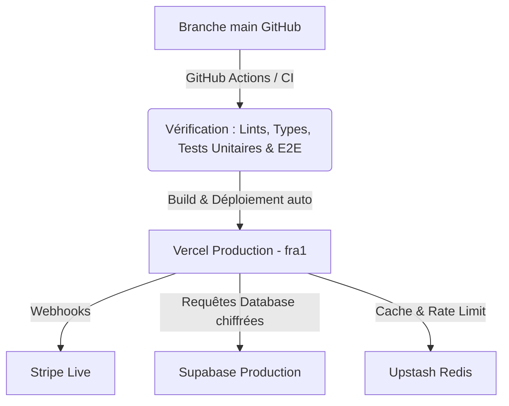
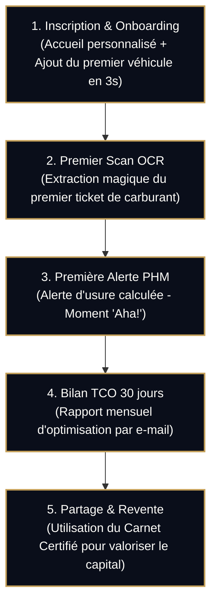

# Stratégie de Déploiement, GTM & Marketing · VeloceWealth
> **Date de rédaction** : 21 Mai 2026  
> **Auteur** : Antigravity (Architecte Fintech & Lead Frontend)  
> **Statut** : Plan GTM V1

---

Ce document détaille la feuille de route opérationnelle, technique et commerciale à suivre immédiatement après la phase de développement de **VeloceWealth** afin de garantir un lancement sécurisé, performant et à forte croissance.

---

## 1. Déploiement Technique & Infrastructures de Production

L'objectif est d'assurer une disponibilité de service maximale ($99.9\%$), une vitesse de chargement instantanée, et une étanchéité de sécurité absolue.

### 1.1. Hébergement Applicatif (Vercel)
* **Configuration multi-région** : Déploiement fixé sur la région **Frankfurt (fra1)** via le fichier `vercel.json` pour être au plus près de la base de données Supabase (RGPD compliancy).
* **Noms de domaines & DNS** :
  * Domaine principal : `velocewealth.app` (ou `.com`).
  * Redirection automatique des requêtes HTTP vers HTTPS avec forçage TLS 1.3.
  * Déclaration des enregistrements TXT pour SPF, DKIM et DMARC afin de légitimer les emails de bienvenue envoyés par l'application.

### 1.2. Base de Données & Stockage (Supabase)
* **Bascule en Production** :
  * Désactiver le mode développement dans le dashboard d'authentification (exiger la confirmation d'email systématique).
  * Exécuter les migrations finales de hardening de base de données.
  * Lancer le script d'audit des politiques RLS (`npm run audit:rls`) pour garantir qu'aucune faille d'accès inter-utilisateurs n'est possible.
* **Sauvegardes (Backups)** :
  * Planifier une sauvegarde physique quotidienne automatisée de la base de données.
  * Répliquer les sauvegardes froides sur un bucket cloud isolé de secours.

### 1.3. Transition vers le Mode Réel (Third-Party APIs)
* **Stripe Live Mode** :
  * Basculer le compte Stripe en mode réel (*live*).
  * Recréer les identifiants de produits et de prix réels dans Stripe, puis mettre à jour les variables `STRIPE_PRICE_MONTHLY` et `STRIPE_PRICE_YEARLY` dans le fichier `.env` de production.
  * Mettre à jour l'URL du webhook Stripe de production pour pointer vers `https://velocewealth.app/api/stripe/webhook` et copier la signature `whsec_...` réelle.
* **Google Cloud & Mapbox** :
  * Restreindre le token d'API public Mapbox aux seuls domaines `velocewealth.app` et ses sous-domaines.
  * Configurer un plafond de budget mensuel d'alerte sur Google Cloud Platform pour l'API Cloud Vision (OCR) afin de bloquer les abus potentiels.

---

## 2. Supervision, Observabilité & Robustesse en Production

Pour piloter l'application comme un instrument de précision, nous mettons en place une surveillance en temps réel de l'état de santé technique et opérationnel.

### 2.1. Erreurs & Crash-reporting (Sentry)
* Configurer le DSN réel sur l'environnement de production.
* Activer le tracking de performance (*Tracing*) à hauteur de $10\%$ des sessions utilisateurs pour analyser la réactivité des requêtes serveur et les temps de réponse de la base de données.

### 2.2. Analyse d'Usage & KPI Métier
* Suivi quotidien des indicateurs de croissance :
  * **Nombre d'utilisateurs actifs mensuels (MAU)** et taux d'inscription quotidien.
  * **Taux de conversion Stripe** (visiteurs de la page `/pricing` $\rightarrow$ abonnés Premium).
  * **Coût moyen de fonctionnement par utilisateur** (calculé via le nombre d'appels OCR Google Vision par rapport aux abonnements perçus).
  * **Volume de transactions et dépenses enregistrées** sur la plateforme (valeur totale du capital automobile piloté).

---

## 3. Stratégie Marketing & Acquisition Client (Go-To-Market)

VeloceWealth ne vend pas un "tracker de factures", mais un **instrument d'optimisation financière**. Le ton marketing doit être expert, exclusif et focalisé sur le retour sur investissement (ROI).

### 3.1. Acquisition Organique (Le Moteur SEO)
Le référencement naturel est le canal d'acquisition le plus rentable à long terme.
* **Pages Programmatiques d'Immatriculation** :
  * Créer des pages de garde publiques optimisées pour le SEO pour chaque modèle de voiture populaire (ex: `/modeles/porsche-911-carrera-tco`).
  * Ces pages affichent des statistiques anonymisées et agrégées (ex: coût d'entretien moyen estimé, mix de dépréciation annuelle). Elles attirent naturellement les internautes effectuant des recherches avant achat.
* **Stratégie de Contenu Financer** :
  * Rédaction d'articles experts sur la gestion du patrimoine automobile :
    * *"Comment le carnet d'entretien certifié augmente la valeur de revente de 12%."*
    * *"L'impact de la taxe sur la masse (malus poids) et de la dépréciation sur votre TCO."*
    * *"Optimiser son entreprise individuelle grâce au barème des frais réels de voiture."*

### 3.2. Le Levier de Croissance Viral (Growth Loop)
* **Partage du "Carnet Numérique Certifié"** :
  * Lors de la vente de son véhicule, l'abonné Premium génère un lien public de consultation de sa voiture (sans données personnelles, uniquement les factures vérifiées, kilométrages et hashs cryptographiques).
  * L'intégration de ce lien sur les plateformes de vente d'occasion (La Centrale, LeBonCoin, Mobile.de) rassure instantanément l'acheteur.
  * Chaque acheteur consultant ce rapport sécurisé découvre **VeloceWealth** au moment idéal de sa prise de décision d'achat, créant une boucle de recommandation virale organique.

### 3.3. Partenariats B2B (Le Réseau VeloceWealth)
* **Les Garages & Spécialistes Indépendants** :
  * Recruter des garages de confiance et les référencer gratuitement sur notre carte Mapbox.
  * Fournir aux professionnels un portail partenaire leur permettant de certifier directement les factures qu'ils émettent pour les abonnés VeloceWealth.
  * En échange, le professionnel gagne en visibilité auprès d'une clientèle qualifiée de propriétaires de véhicules haut de gamme.
* **Clubs Automobiles & Assureurs** :
  * Mettre en place des partenariats d'affiliation avec des clubs de marque (Porsche Club, Club Alpine, etc.) offrant 3 mois d'essai Premium à leurs membres.
  * Négocier avec des courtiers en assurances premium des remises sur la prime d'assurance des utilisateurs qui maintiennent un excellent score de santé PHM (preuve de conduite et d'entretien rigoureux).

### 3.4. Campagnes d'Acquisition Payantes (Paid)
* **Publicités ciblées sur les réseaux sociaux (Meta Ads / Instagram)** :
  * Cibler les passionnés d'automobile, les abonnés aux magazines de finance/gestion de patrimoine et les propriétaires de modèles premium.
  * Mettre en avant la simplicité de la numérisation OCR ("Prenez votre reçu en photo, nous calculons votre rentabilité").
* **LinkedIn Ads** :
  * Cibler les professions libérales (médecins, avocats, consultants) et les dirigeants de PME qui roulent beaucoup sous le régime fiscal des frais réels.

---

## 4. Rétention & Cycle de Vie Client

Garder un client coûte 5 fois moins cher que d'en acquérir un nouveau.

* **Onboarding Utilisateur Fluide** :
  * L'inscription doit immédiatement mener à l'ajout du premier véhicule par plaque d'immatriculation. L'affichage instantané des données de la voiture valide immédiatement la proposition de valeur.
* **Emailings d'Optimisation Mensuelle** :
  * Envoyer un rapport mensuel personnalisé : *"Ce mois-ci, votre TCO a baissé de 2% grâce à vos recharges en heures creuses. Votre score de santé est excellent. Pensez à planifier votre révision dans 3 200 km."*
* **Support Client Intégré** :
  * Le chatbot intelligent présent sur l'application résout instantanément $80\%$ des interrogations courantes (FAQ, facturation, fonctionnement du TCO).
  * Les $20\%$ restants sont transmis à un support client par email premium avec un engagement de réponse en moins de 12 heures.
