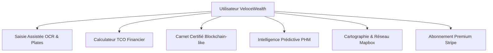

# Spécifications Produit · VeloceWealth
> **Date de rédaction** : 21 Mai 2026  
> **Auteur** : Antigravity (Architecte Fintech & Lead Frontend)  
> **Statut** : Version 1.0 (Prêt pour Revue de Lancement)

---

## 1. Vision & Positionnement Stratégique

**VeloceWealth** (anciennement AutoSmart Pro) est une plateforme SaaS Fintech haut de gamme conçue pour transformer la gestion automobile. Contrairement aux outils de suivi basiques, VeloceWealth aborde le véhicule non pas comme un simple centre de coût, mais comme un **actif financier optimisé**. 

### Mission
Fournir aux collectionneurs, propriétaires de véhicules premium et gestionnaires de flottes un instrument de contrôle absolu permettant de minimiser le coût total de possession (TCO) et de maximiser la valeur résiduelle de revente grâce à la certification et à la maintenance prédictive.

### Identité Visuelle & Artistique
* **Esthétique** : Interface minimaliste, harmonieuse et sombre (Noir Obsidienne/Anthracite), inspirée d'un cockpit d'ingénierie et d'un terminal de trading.
* **Typographie** : Polices modernes et affirmées (e.g. *Outfit* pour les titres structurés, *JetBrains Mono* ou *IBM Plex Mono* pour la rigueur des données financières).
* **Finition** : Texture papier subtile (bruit CSS `0.04`), conteneurs *glassmorphic* avec flous d'arrière-plan, et micro-animations fluides (GSAP / Framer Motion).

---

## 2. Personas & Utilisateurs Cibles

1. **L'Investisseur Automobile / Collectionneur** : Possède un ou plusieurs véhicules haut de gamme. Sa priorité absolue est le maintien de la valeur résiduelle à travers un historique d'entretien inaltérable (Carnet Certifié).
2. **Le Conducteur Premium Éco-Responsable** : Propriétaire d'un véhicule hybride ou électrique. Il cherche à optimiser son mix énergétique, à profiter des heures creuses de recharge, et à suivre précisément sa transition énergétique.
3. **Le Gestionnaire de Petite Flotte (B2B)** : A besoin d'une vision globale centralisée, d'exports fiscaux simplifiés (régime des frais réels), et d'une prise de rendez-vous fluide avec un réseau de garages partenaires.

---

## 3. Architecture Fonctionnelle du Produit

Le produit s'articule autour de six piliers technologiques majeurs :

### 3.1. Saisie Ultra-Rapide & Automatisée
* **Lookup Immatriculation & VIN Cascade** : 
  * Cascade : Cache local Redis $\rightarrow$ API SIV (France) ou DVLA (UK) $\rightarrow$ API NHTSA (USA) en fallback $\rightarrow$ Saisie manuelle en dernier recours.
  * RGPD *by design* : Seules les données techniques (marque, modèle, cylindrée, motorisation, couleur, année, VIN) sont collectées. Aucune donnée nominative (nom du titulaire, adresse) n'est jamais extraite ou stockée.
* **Numérisation de documents (OCR)** : 
  * Intégration de **Google Cloud Vision API**.
  * Analyse des tickets de carburant/recharges et des factures d'entretien A4.
  * Extraction automatique : montant TTC, volume/énergie, nom de l'établissement, date, kilométrage inscrit.
  * Pré-remplissage des formulaires pour éliminer la friction de saisie.

### 3.2. Moteur de Calcul TCO (Total Cost of Ownership)
Calcule en temps réel le coût d'usage exact de chaque véhicule.
* **Formule de TCO au Kilomètre** :
  $$\text{Coût/Km} = \frac{\text{Dépenses Énergétiques} + \text{Frais de Maintenance} + \text{Assurance Amortie}}{\text{Distance Parcourue sur la Période}}$$
* **Mix Énergétique** : Graphiques de répartition Thermique vs Électrique (en valeur financière et physique kWh/L).
* **Valorisation** : Algorithme prévisionnel de dépréciation croisé avec les données du marché local pour estimer la valeur de revente future.

### 3.3. Carnet d'Entretien Certifié (Immuabilité)
* **Preuve d'Intégrité** : Chaque facture ou intervention saisie génère un hash SHA-256 cryptographique chaîné à l'entrée précédente (principe de blockchain).
* **Immutabilité stricte** : Verrouillage absolu en base de données. Les requêtes `UPDATE` et `DELETE` sur la table `maintenance_entries` sont rejetées par des triggers PostgreSQL (même avec les privilèges admin de l'application).
* **Export Certifié** : Génération d'un carnet d'entretien PDF exportable avec filigrane de conformité et signatures cryptographiques pour prouver le suivi rigoureux lors de la revente.

### 3.4. Intelligence de Maintenance Prédictive (PHM)
Le module PHM (*Prognostics and Health Management*) simule des modèles avancés de fiabilité industrielle :
* **Détection d'Anomalie (Z-Score)** : Analyse des paramètres OBD (RPM, charge, température liquide, MAF, batterie) pour remonter immédiatement une anomalie mécanique ou électrique.
* **Analyse de Survie (Weibull)** : Estime la Durée de Vie Utile Restante (*Remaining Useful Life* - RUL) des composants critiques (freins, pneus, filtres, batterie) selon l'usure kilométrique réelle.
* **Classification Forest** : Synthétise l'état du composant (Excellent, Usure modérée, Panne imminente) avec un taux de confiance statistique simulé par apprentissage automatique.

### 3.5. Cartographie interactive (Mapbox)
* **Stations-services & Bornes** : Affichage des stations-services locales et des bornes de recharge électrique à proximité avec le détail des connecteurs et puissances de charge disponibles.
* **Réseau de Partenaires** : Cartographie des garages partenaires VeloceWealth identifiés (notation, services proposés, remises exclusives).

### 3.6. Module d'Abonnement (Stripe)
* **Niveaux de Tarifs** : Standard, Premium, Flotte et Partenaire.
* **Stripe Tax** : Calcul automatique de la TVA locale en fonction du pays de résidence de l'utilisateur.
* **Portail Client** : Espace d'auto-gestion permettant de modifier la formule d'abonnement, de mettre à jour le moyen de paiement, d'annuler en un clic et de télécharger les factures.

---

## 4. Spécifications Techniques

### 4.1. Stack Applicative
* **Frontend** : Next.js 14 (App Router) + React 18, TypeScript, Tailwind CSS, Lucide React (Icônes), Recharts (Graphiques).
* **Internationalisation** : `next-intl` (FR, EN, ES, PT, AR). Support natif des langues à écriture bidirectionnelle (**RTL**) comme l'Arabe.
* **Base de Données & Stockage** : Supabase (PostgreSQL), buckets Supabase Storage chiffrés (`receipts`, `invoices`, `vehicle-photos`, `avatars`).
* **Cache & Limiteur** : Upstash Redis pour le rate-limiting HTTP et le cache du Lookup immatriculations.

### 4.2. Flux de Sécurité & Robustesse
* **Headers de Sécurité (Strict HTTP)** : CSP strict (Content Security Policy), HSTS (2 ans), X-Content-Type-Options (nosniff), X-Frame-Options (DENY), Referrer-Policy.
* **Row Level Security (RLS)** : Toutes les tables de la base de données PostgreSQL appliquent une clause d'isolation `auth.uid() = user_id`.
* **Triggers de Télémétrie & Audit** : Table `audit_logs` en append-only qui enregistre les signatures de transactions.

## 5. Modèle de Tarification (Pricing Structure)

La tarification de VeloceWealth est alignée avec la configuration active de production (Stripe API) et les traductions de l'application :

| Fonctionnalité / Plan | Standard (Gratuit) | Pro (9,99€/mois ou 89€/an) | Fleet (19,99€/mois ou 199€/an) | Garage Partenaire (49€/mois) |
| :--- | :---: | :---: | :---: | :---: |
| **Nombre de véhicules** | 1 | Illimité | Jusqu'à 5 (par compte) | Non applicable |
| **Requêtes OCR /mois** | 3 offertes | Illimité | Illimité | Non applicable |
| **Carnet d'entretien certifié** | Non (manuel) | Oui (PDF exportable) | Oui (Toutes les fonctions Pro) | Non applicable |
| **Suivi TCO & Alertes PHM** | Rappels de base / Carte | Oui (TCO complet + PHM) | Oui (TCO complet + PHM) | Non applicable |
| **Export Fiscal (Frais réels)** | Non | Oui | Oui | Non applicable |
| **Gestion & Comptes** | Individuel | Individuel | Multi-comptes / Consolidé | Non applicable |
| **Visibilité & Profil Carte** | Non | Non | Non | Oui (Profil enrichi) |
| **Génération de leads & RDV** | Non | Non | Non | Oui (Prise de RDV intégrée) |

> [!NOTE]
> Tous les prix sont exprimés en TTC. La taxe est calculée automatiquement selon le pays de résidence de l'utilisateur grâce à l'intégration de **Stripe Tax** en production. Une réduction de **-25%** est appliquée sur les engagements annuels du plan Pro (89€/an) et Fleet (199€/an).

## 6. Plan de Test & Recette Produit

Avant chaque publication en production, la plateforme valide le cycle suivant :
* **Tests Unitaires (Vitest)** : Couverture complète des modules critiques (`lib/computations.ts`, `lib/validators/*`).
* **Tests E2E (Playwright)** : Simulation complète du parcours utilisateur (authentification, création de véhicule, validation du checkout Stripe, navigation multilingue).
* **RLS Security Audit** : Script automatique (`npm run audit:rls`) effectuant des requêtes croisées entre deux utilisateurs factices pour prouver l'étanchéité absolue de la base de données.
